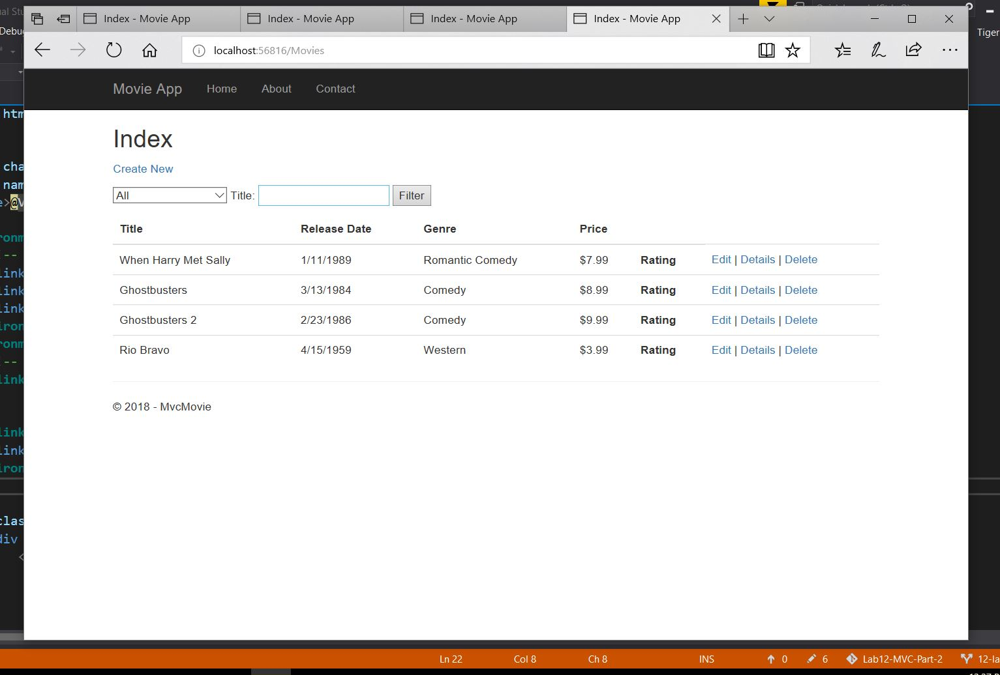

## Movie-MVC-Enity-Framework
The Start of the bare bones Model View Controller, This web application allows users to
interact with a database. The data base is called movie database, users can add movies
with inputs such as Name of movie, Date of movie, Genre of movie, and Price of movie.

## Author:
Tiger Hsu

## Version
2.0.0 

## Overview
This web application is a database. This is a fully functional Model, View, Controller framework
that is using the .NET core and the Entity-database-Framework. A majority of this application is 
taken directly from the .NET tutorial written by Rick Anderson. The functions were built out
in controllers using Post Put Methods. The Controller then sends for the Post/Put methods to 
retrieve the razor pages. 

## Getting Started
1. Clone the repository to your local machine.
2. Select into application directory where the *AppName.sln* exist.
3. Open the application using *Open/Start AppName.sln*.
5. The website will run on your default web browser routing to the main home page.

## Example

## Architecture
 - C# ASP.NET Core application.
 - MVC architectural design pattern.
 - Entity Framework - built in Visual Studio

## Attribution
Rick Anderson

## Resources
StackoverFlow
Microsoft Docs

## License
MIT License

## Change Log
04-08-2018 4:59pm
